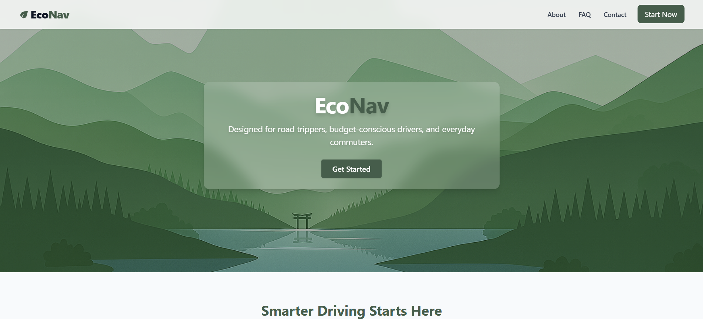
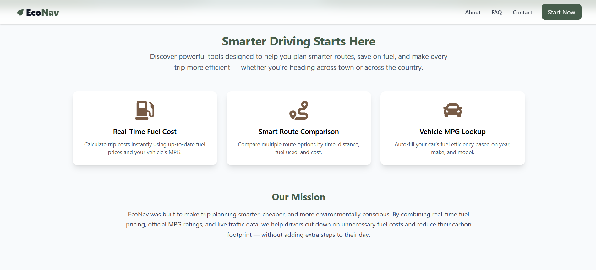
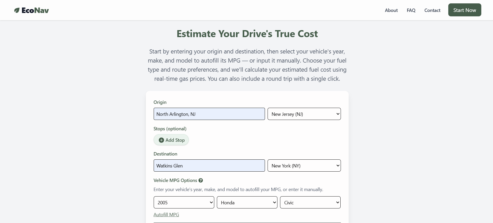
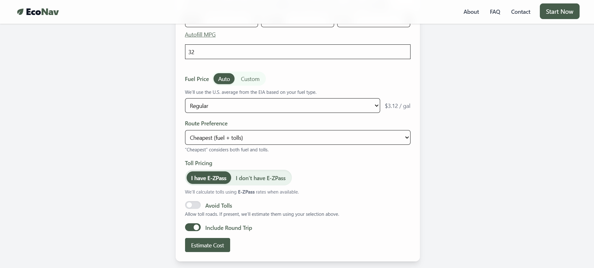
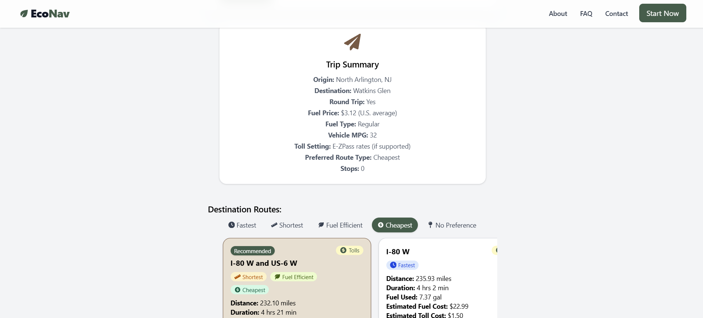
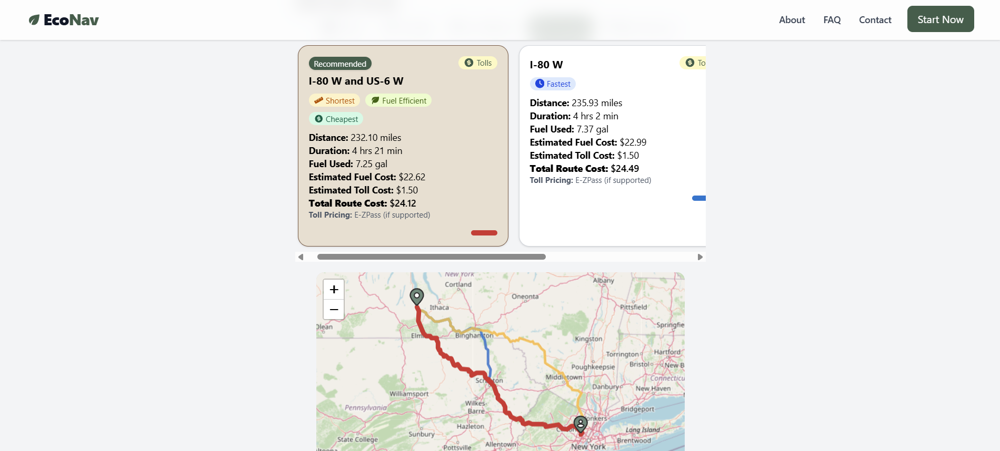

# EcoNav – Route Fuel & Toll Cost Optimizer 🚗⛽

[](LICENSE)

EcoNav is a full-stack web application that helps drivers **estimate trip fuel and toll costs**.  
It compares multiple route options by **time, distance, fuel efficiency, tolls, and total cost**, giving users the power to choose the best route for their needs.

👉 *Built as a Computer Science senior project & MVP portfolio app.*

---

## 🌟 Features
- Real-time route cost estimation with **Google Routes API**
- Automatic gas price lookup from **EIA (U.S. Energy Information Administration)**
- Vehicle fuel efficiency via **EPA Fuel Economy API**
- Compare routes by:
  - ⏱ Fastest  
  - 📏 Shortest  
  - 🌱 Most Fuel Efficient  
  - 💵 Cheapest  
- Interactive maps with **Leaflet** (click cards ↔ highlight routes)
- Toll calculation with **E-ZPass support**
- Option to override with custom fuel prices
- Smooth UX touches:
  - Stable route colors across filters  
  - Smooth scroll to results  
  - Mobile-friendly design

---

## 🖼 Screenshots

### Home Page


### Features Section


### Input Form
  


### Trip Results
  


---

## 🛠 Tech Stack

**Frontend**
- 
- 
- 
- 

**Backend**
- 
- 

**APIs**
- 
- 
- 

**Other**
- 
- 

---

## 🚀 Getting Started

### Prerequisites
- Node.js (v18+ recommended)
- API keys for:
  - Google Maps (Routes + Geocoding)
  - EIA Fuel Prices
  - EPA Fuel Economy (public, no key required)

---

### Backend Setup
```bash
cd backend
npm install
cp .env.example .env   # add your API keys
npm start

